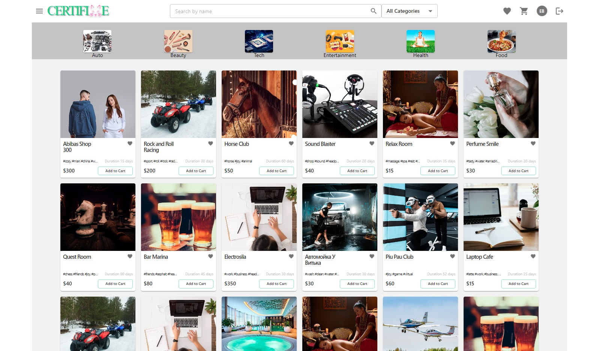
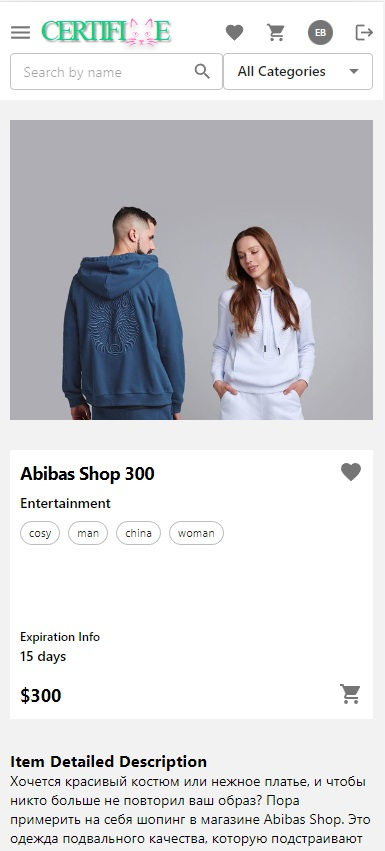
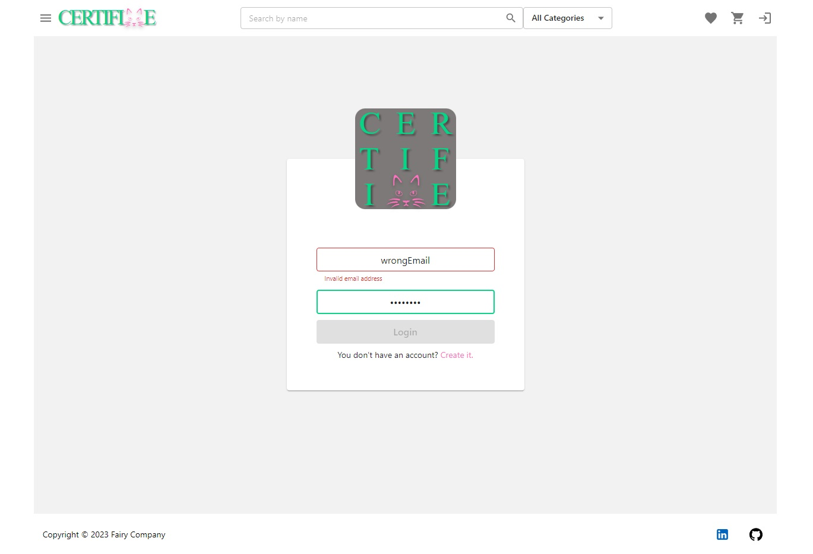
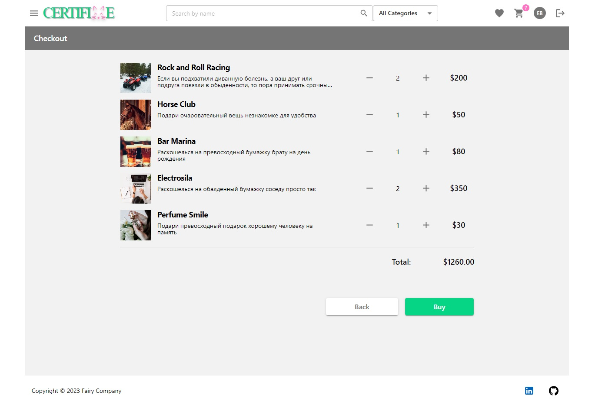
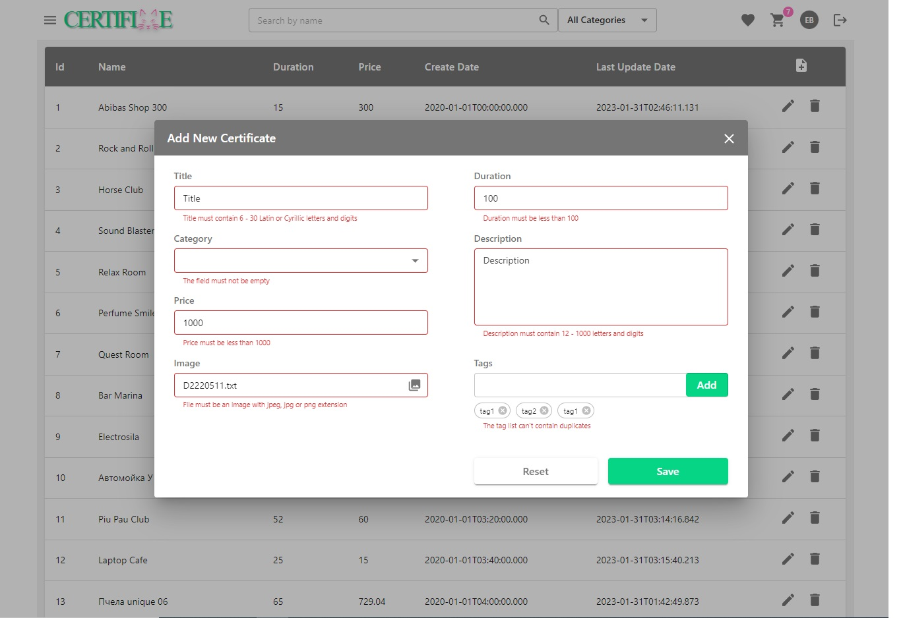

# Certificate
A project represents an electronic store where you can find and purchase a gift certificate. 
It is created with Spring Boot (backend) and React (frontend). Application is mobile adapted (device min width 350px)

###Backend
Interaction with the database uses Spring Data. Authentication and authorization is carried out with Spring Security.

###Frontend
Material UI library is taken as the basis for components and site theme. 
Transitions between pages handled by React Router. Storage for application state manages with Redux Toolkit.

React Hook Form validate and handle data from forms

##Guide
1. Create database and fill it with sql files in web/src/main/resources/tablesql directory 
(you can use your initial data, data.sql is an example)
2. Fill property file (database, logger, token props and address of image directory)
3. Put your pictures for certificates and categories in specified directory in props + path in database
4. Execute maven package phase for root module
5. Launch jar file in web/target/certificate.jar

